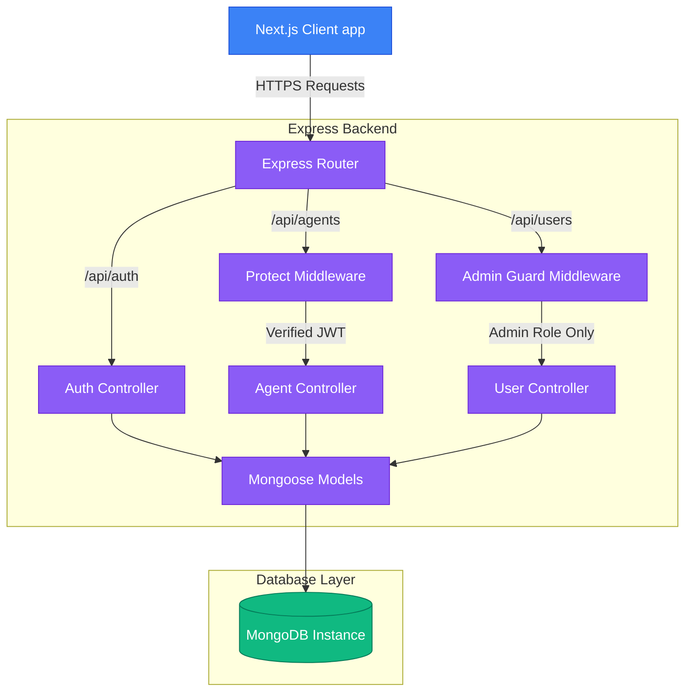

# System Design & Architecture: Aether AI

This document details the architectural decisions, database models, directory configurations, and authentication pathways designed for **Aether AI**.

---

## High-Level Architecture Diagram



---

## Folder Structure & Module Separation

We have partitioned the workspace into isolated `/backend` and `/frontend` directories to prevent namespace clashes and establish clean development separation.

### Backend Layout
```
/backend
├── config/             # Database connection setup
├── controllers/        # Request controllers containing core business logic
├── middleware/         # Auth verification and RBAC checks
├── models/             # Mongoose schemas for collections
├── routes/             # Path routing and endpoint binds
├── .env.example        # Env configuration template
└── server.js           # Server application bootstrap file
```
**Reasoning**: Decoupling the routing paths from database logic and controller behaviors ensures that endpoints can be modified or tested in isolation without risking database schema integrity.

### Frontend Layout
```
/frontend
├── app/                # Next.js App Router folders
│   ├── (marketing)/    # Route group for landing, services, and login views (with Nav/Footer)
│   ├── (dashboard)/    # Route group for protected admin/user workspace (with Sidebar layout)
│   └── globals.css     # Global styles and tailwind directives
├── components/         # Shared presentation elements (Navbar, Footer)
├── lib/                # API client helper functions and state checks
├── postcss.config.js   # CSS compiler setup
└── tailwind.config.js  # Styling spacing tokens and brand palettes
```
**Reasoning**: Next.js App Router groups (e.g. `(marketing)` and `(dashboard)`) allow us to apply different layouts (e.g. sidebar vs. navbar) automatically depending on routing path names.

---

## Data Models (MongoDB Schema)

### Users Collection
*   **Collection Name**: `users`
*   **Schema Definition**:
    *   `name`: String, required.
    *   `email`: String, required, lowercase, unique index.
    *   `password`: String, required, hashed via `bcryptjs` (excluded from default SELECT queries).
    *   `role`: String, enum: `['user', 'admin']`, default: `user`.
    *   `createdAt`: Date, default: `Date.now`.
*   **Indexes**: Unique index on `email`.

### Agents Collection
*   **Collection Name**: `agents`
*   **Schema Definition**:
    *   `name`: String, required.
    *   `type`: String, required, enum: `['support', 'research', 'workflow', 'custom']`.
    *   `status`: String, enum: `['active', 'idle', 'failed']`, default: `idle`.
    *   `owner`: ObjectId, ref: `User`, required.
    *   `config`: Sub-document object.
        *   `description`: String.
        *   `temperature`: Number (range 0.0 - 1.0), default: 0.7.
        *   `systemPrompt`: String.
    *   `createdAt`: Date, default: `Date.now`.
*   **Indexes**: Query index on `owner` for high-speed workspace loading.

---

## Authentication & Authorization Flow

1.  **JWT Signing**: When a user registers or logs in, the backend signs a JSON Web Token payload containing the user's Mongoose ID (`{ id: user._id }`) using a secure `JWT_SECRET`.
2.  **State Storage**: The client caches this token inside `localStorage` along with a subset of user credentials (`role`, `name`).
3.  **Client Headers**: Every subsequent client query to the backend sets `Authorization: Bearer <token>` in the fetch headers.
4.  **Route Protection (`protect`)**: Middleware interceptor extracts the token, decodes the user ID, verifies credentials against the DB, and sets `req.user` inside the execution scope.
5.  **Role Verification (`authorize('admin')`)**: A downstream middleware interceptor audits the user's role before letting request resolve.

---

## API Surface

| Method | Endpoint | Authorized Roles | Function |
| :--- | :--- | :--- | :--- |
| **POST** | `/api/auth/register` | Public | Register new user + return JWT token |
| **POST** | `/api/auth/login` | Public | Login credentials check + return JWT token |
| **GET** | `/api/auth/me` | User, Admin | Fetch profile metadata |
| **GET** | `/api/agents` | User (own), Admin (all) | Retrieve list of active agents (with optional search) |
| **POST** | `/api/agents` | User, Admin | Deploy a new agent |
| **PUT** | `/api/agents/:id` | Owner, Admin | Update agent configuration details |
| **DELETE** | `/api/agents/:id` | Owner, Admin | Terminate & delete agent configuration |
| **GET** | `/api/users` | Admin Only | Auditing - list all user profiles |
| **PUT** | `/api/users/:id` | Admin Only | Auditing - alter a user's system role |
| **DELETE** | `/api/users/:id` | Admin Only | Auditing - delete a user account |

---

## Architectural Trade-offs & Future Scopes

1.  **LocalStorage vs. HTTP-only cookies**:
    *   *Trade-off*: We chose standard header-based JWT tokens in `localStorage` for rapid cross-origin API integration.
    *   *Future improvement*: Transition to SameSite HTTP-only cookies to completely eliminate potential XSS vulnerabilities.
2.  **No Server-Side Session Synchronization**:
    *   *Trade-off*: JWT verifies sessions statelessly to scale efficiently.
    *   *Future improvement*: Implement a Redis token-revocation denylist to instantly terminate compromised user credentials in real-time.
